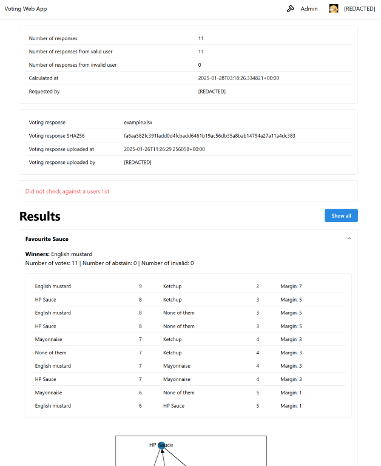

# Voting Web App

The app takes ranking ballots collected with Microsoft Forms within an organisation, and calculates the results using ranked pairs method (instead of the Microsoft Forms built-in point-based method) and visualises the results. It optionally checks against a list of eligible voters in an organisation.

To learn more about the ranked pairs method, see [ranked pairs on Wikipedia](https://en.wikipedia.org/wiki/Ranked_pairs). To interactively learn about different voting methods, see Nicky Case's [To Build a Better Ballot](https://ncase.me/ballot) (it does not go into the details of the ranked pairs method though).

## Setup Voting Form

See [voting setup instructions](https://voting-demo.cjxol.com/setup-instructions/).

## Deploy

## Development

1. Copy `.env.prod` to `.env` and fill in the required values
2. Run `docker-compose up`

### Run backend

1. Go to `backend` folder
2. Create and activate a Python virtual environment (Python 3.10 or later)
3. Run `pip install -r requirements.txt`
4. Copy `.env.example` to `.env` and fill in the required values
5. Create `data` folder
6. Run `fastapi dev main.py`

### Run frontend

1. Go to `voting-webapp-frontend` folder
2. Run `npm install --force`
3. Run `npm run dev`

### Demo

[Live demo](https://voting-demo.cjxol.com). Please do not upload any sensitive data.

#### Upload user list and voting responses

#### Calculation configurations

#### Results

### TODO

- [ ] Use D3.js or similar for visualising the results
